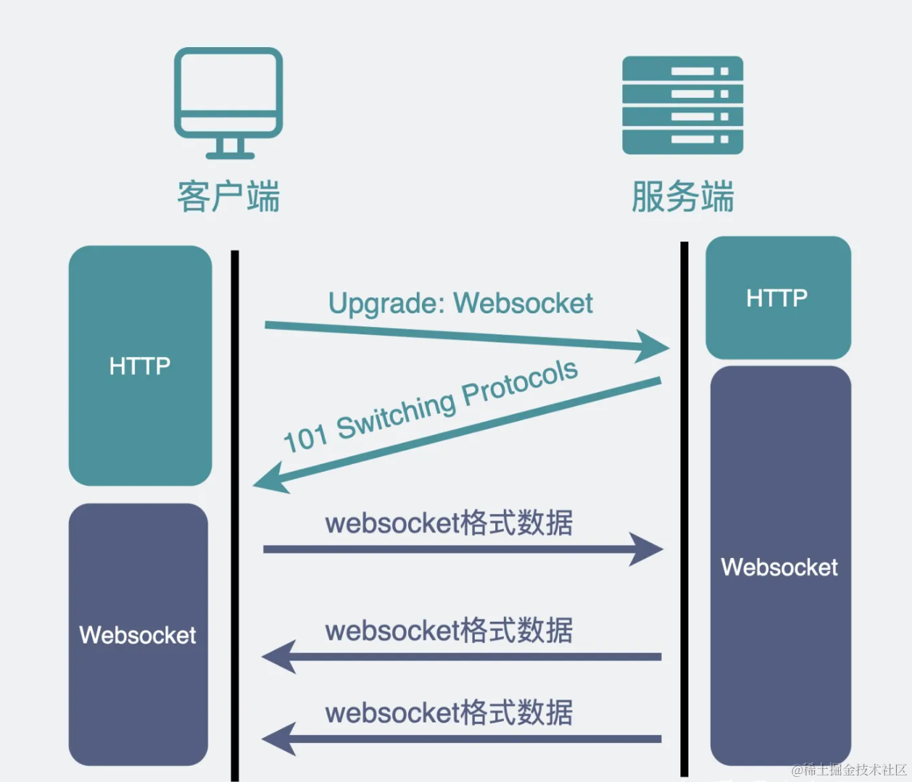
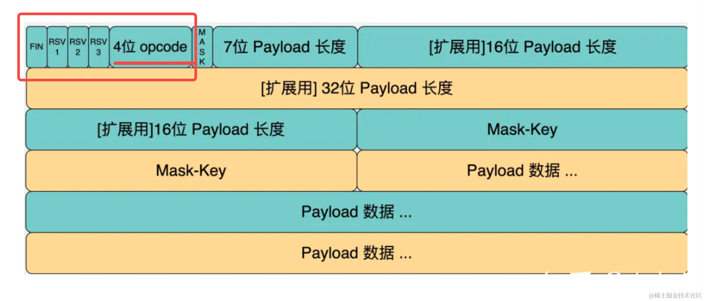

# 用 Node.js 手写 WebSocket 协议
其实还是挺清晰的，一个切换协议的过程，然后是二进制的 weboscket 协议的收发。

## 图解
### 需要一次从 HTTP 到 WebSocket 的切换过程

### websocket协议

## 总结
实时性较高的需求，我们会用 websocket 实现，比如即时通讯、游戏等场景。

websocket 和 http 没什么关系，但从 http 到 websocket 需要一次切换的过程。

这个切换过程除了要带 upgrade ·的 header 外，还要带 sec-websocket-key，服务端根据这个 key 算出结果，通过 sec-websocket-accept 返回。响应是 101 Switching Protocols 的状态码。

这个计算过程比较固定，就是 key + 固定的字符串 通过 sha1 加密后再 base64 的结果。

加这个机制是为了确保对方一定是 websocket 服务器，而不是随意返回了个 101 状态码。

之后就是 websocket 协议了，这是个二进制协议，我们根据格式完成了 websocket 帧的解析和生成。

这样就是一个完整的 websocket 协议的实现了。
