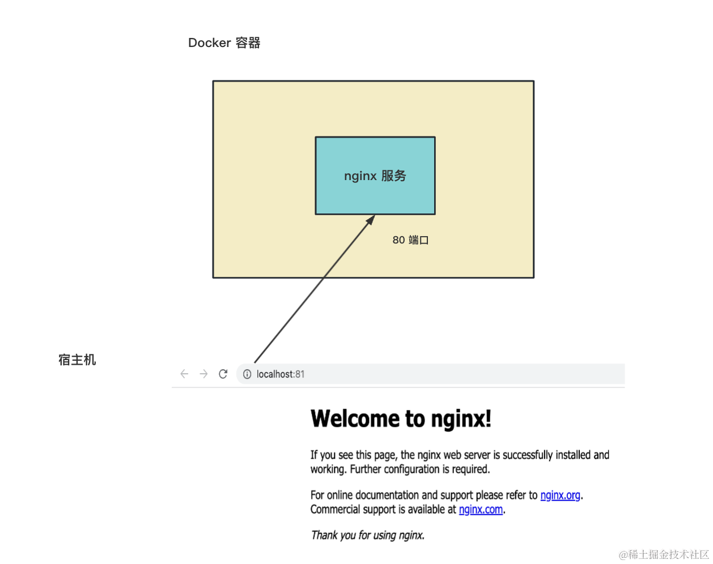
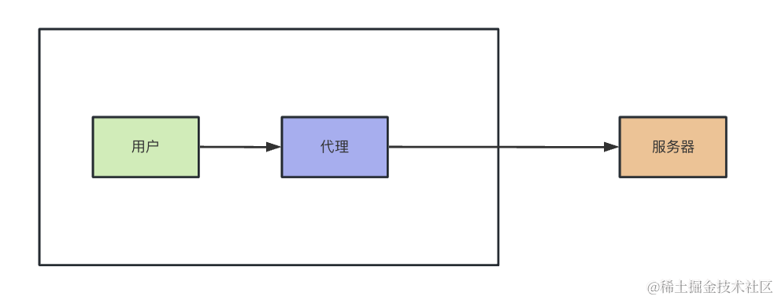
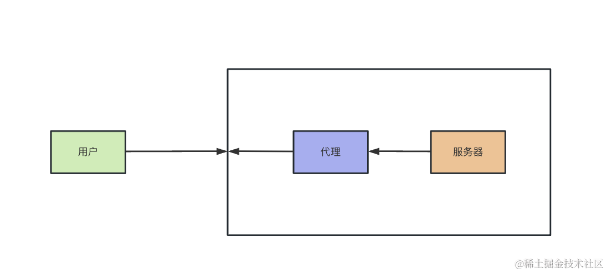
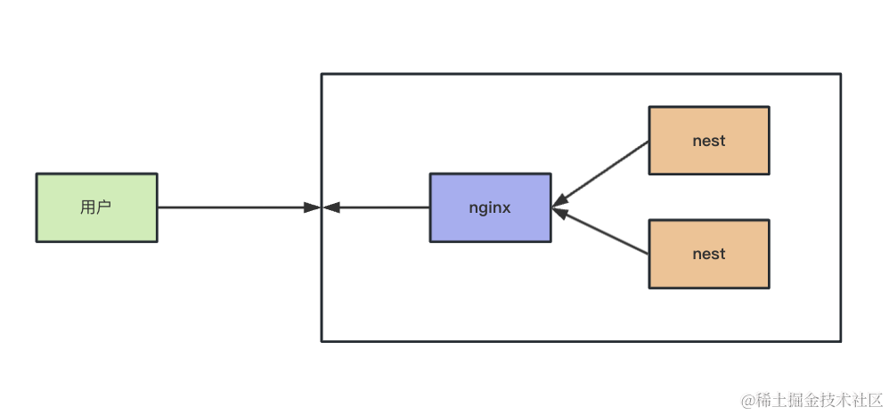

# nginx
Nginx 是流行的服务器，一般用它对静态资源做托管、对动态资源做反向代理。

docker 容器里跑的服务:



## 命令
```bash
# 先把这个目录复制出来
# mac ~/nginx-html
docker cp nginx1:/usr/share/nginx/html ~/nginx-html
# windows
docker cp nginx1:/usr/share/nginx/html D:\project\nodejs-basic\src\src/nginx-test/nginx-html

# 比如我们把这个目录再复制到容器里：
docker cp D:\project\nodejs-basic\src\src/nginx-test/nginx-html nginx1:/usr/share/nginx/html-xxx

# 然后我们在这个目录下添加两个 html 来试试看
echo aaa > aaa.html
echo bbb > bbb.html
docker cp D:\project\nodejs-basic\src\src/nginx-test/nginx-html nginx1:/usr/share/nginx/html


# 看下 nginx 配置文件
docker cp nginx1:/etc/nginx/nginx.conf D:\project\nodejs-basic\src\src/nginx-test/nginx-html

# 目录 conf.d 是 configuration directory 的意思
docker cp nginx1:/etc/nginx/conf.d D:\project\nodejs-basic\src\src/nginx-test/nginx-html


# 修改 conf.d
# 把这个文件复制到容器内
docker cp D:\project\nodejs-basic\src\src/nginx-test/nginx-html/conf.d/default.conf nginx1:/etc/nginx/conf.d/default.conf

# 然后在容器内的 terminal 执行：
nginx -s reload
```


## 概念

### 静态文件托管
location root 和 alias 的区别就是拼接路径时是否包含匹配条件的路径。

主配置文件在 /etc/nginx/nginx.conf，而子配置文件在 /etc/nginx/conf.d 目录下。

默认的 html 路径是 /usr/share/nginx/html。


#### 小结

总结一下，一共 4 个 location 语法：

location = /aaa 是精确匹配 /aaa 的路由。

location /bbb 是前缀匹配 /bbb 的路由。

location ~ /ccc.*.html 是正则匹配。可以再加个 * 表示不区分大小写 location ~* /ccc.*.html

location ^~ /ddd 是前缀匹配，但是优先级更高。

这 4 种语法的优先级是这样的：

**精确匹配（=） > 高优先级前缀匹配（^~） > 正则匹配（～ ~*） > 普通前缀匹配**


### 动态资源的反向代理
什么是正向、什么是反向呢？

从用户的角度看，方向一致的就是正向，反过来就是反向。

比如这样两个代理：




第一个是正向代理，第二个是反向代理。

第一个代理是代理的用户请求，和用户请求方向一致，叫做正向代理。

第二个代理是代理服务器处理用户请求，和用户请求方向相反，叫做反向代理。


####　作用
- 这就是反向代理服务器的作用，可以透明的修改请求、响应。
- 而且，还可以用它实现负载均衡

现在有一个 nginx 服务器，两个 nest 服务器了，nginx 该如何应对呢？



nginx 的解决方式就是负载均衡，把请求按照一定的规则分到不同的服务器。

因为默认是轮询的方式。

一共有 4 种负载均衡策略：
- 轮询：默认方式。
- weight：在轮询基础上增加权重，也就是轮询到的几率不同。
- ip_hash：按照 ip 的 hash 分配，保证每个访客的请求固定访问一个服务器，解决 session 问题。
- fair：按照响应时间来分配，这个需要安装 nginx-upstream-fair 插件。


## 总结
我们通过 docker 跑了 nginx 服务器，并使用了它的静态资源托管功能，还有动态资源的反向代理功能。

nginx 的配置文件在 /etc/nginx/nginx.conf 里，它默认还引入了 /etc/nginx/conf.d 下的子配置文件。

默认 html 都放在 /usr/share/nginx/html 下。

我们可以通过 docker cp 来把容器内文件复制到宿主机来修改。

修改 nginx 配置，在 server 里配置路由，根据不同的 url 返回不同的静态文件。

有 4 种 location 语法：

location /aaa 根据前缀匹配
location ^~ /aaa 根据前缀匹配，优先级更高
location = /aaa 精准匹配
location ~ /aaa/.*html 正则匹配
location ~* /aaa/.*html 正则匹配，而且不区分大小写
优先级是 精确匹配（=） > 高优先级前缀匹配（^~） > 正则匹配（～ ~*） > 普通前缀匹配

除了静态资源托管外，nginx 还可以对动态资源做反向代理。

也就是请求发给 nginx，由它转发给应用服务器，这一层也可以叫做网关。

nginx 反向代理可以修改请求、响应信息，比如设置 header。

当有多台应用服务器的时候，可以通过 upstream 配置负载均衡，有 4 种策略：轮询、带权重的轮询、ip_hash、fair。

掌握了静态资源托管、动态资源的反向代理+负载均衡，就算是掌握了 Nginx 的核心用法了。
