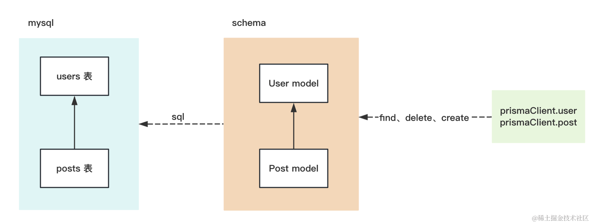

# 快速入门 ORM 框架 Prisma


## 命令
```bash
# 创建项目
mkdir prisma-test
cd prisma-test
npm init -y

# 安装 typescript 相关的包
npm install typescript ts-node @types/node --save-dev

# typescript 是 tsc 编译器的包，ts-node 可以直接跑 ts 代码，而 @types/node 是 node api 的类型声明。
# 然后创建 tsconfig.json
npx tsc --init

# 安装 prisma
npm install prisma --save-dev

# 生成schema 层的代码
# 创建好了数据库，把生成的文件.env中的数据库的账号密码和表名修改
npx prisma init --datasource-provider mysql

# 只要基于它生成 client 的代码，就可以来 crud 了
npx prisma migrate dev --name aaa

# 运行
npx ts-node ./src/index.ts
```


## 整个流程



## 总结
我们学习了 ORM 框架 prisma，它和 typeorm 大同小异。

typeorm 是把表映射成 entity 类，然后调用 repository 的 api 来做 CRUD。

prisma 是把条映射成 schema 的 model，然后编译生成 client 代码，之后进行 crud。

用到这两个命令：

primsa init 创建 schema 文件

prisma migrate dev 根据 schema 文件生成 sql 并执行，还会生成 client 代码。

之后就是 CRUD 了，涉及到 findMany、create、delete、update 等 api。

这节只是入了个门，下节来更全面的掌握 prisma。
