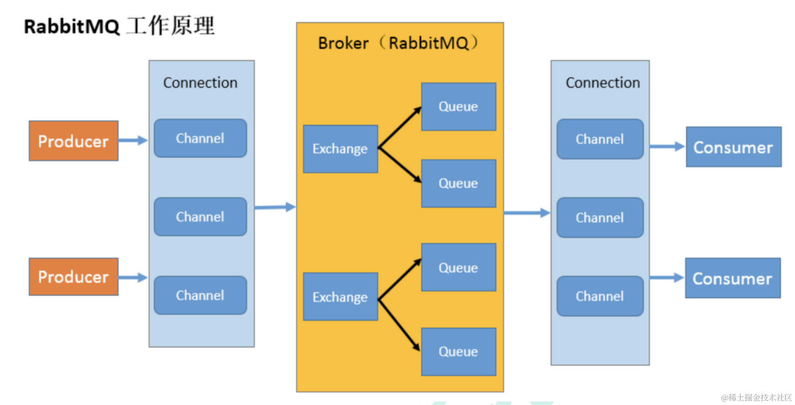

# 为什么前端监控系统要用 RabbitMQ？

总结下 rabbitmq 解决了什么问题：
- 流量削峰：可以把很大的流量放到 mq 种按照一定的流量上限来慢慢消费，这样虽然慢一点，但不至于崩溃。
- 应用解耦：应用之间不再直接依赖，就算某个应用挂掉了，也可以再恢复后继续从 mq 中消费消息。并不会一个应用挂掉了，它关联的应用也挂掉。

比如前端监控系统的后端服务，就很适合使用 mq 来做流量削峰。


## 命令
```bash
# 创建个项目
mkdir rabbitmq-test
cd rabbitmq-test
npm init -y

# 安装用到的包
npm install amqplib

```


## 整体架构图


Producer 和 Consumer 分别是生产者和消费者。

Connection 是连接，但我们不会每用一次 rabbitmq 就创建一个单独的 Connection，而是在一个 Connection 里做一下划分，叫做 Channel，每个 Channel 做自己的事情。

而 Queue 就是两端存取消息的地方了。

整个接收消息和转发消息的服务就叫做 Broker。

至于 Exchange，我们前面的例子没有用到，这个是把消息放到不同的队列里用的，叫做交换机。

Exchange 主要有 4 种：
- fanout：把消息放到这个交换机的所有 Queue
- direct：把消息放到交换机的指定 key 的队列
- topic：把消息放到交换机的指定 key 的队列，支持模糊匹配
- headers：把消息放到交换机的满足某些 header 的队列


## 总结
前端监控系统会收到很多来自用户端的请求，如果直接存入数据库很容易把数据库服务搞挂掉，所以一般会加一个 RabbitMQ 来缓冲。

它是生产者往 queue 里放入消息，消费者从里面读消息，之后确认消息收到的流程。

当一对多的时候，还要加一个 Exchange 交换机来根据不同的规则转发消息：

direct 交换机：根据 routing key 转发消息到队列
topic 交换机：根据 routing key 转发消息到队列，支持模糊匹配
headers 交换机：根据 headers 转发消息到队列
fanout 交换机：广播消息到交换机下的所有队列
而且消费者可以设置一个消费的并发上限，这样就可以保证服务不会因并发过高而崩溃。

这就是流量削峰的功能。

RabbitMQ 在后端系统中经常能见到，是很常用的中间件。
